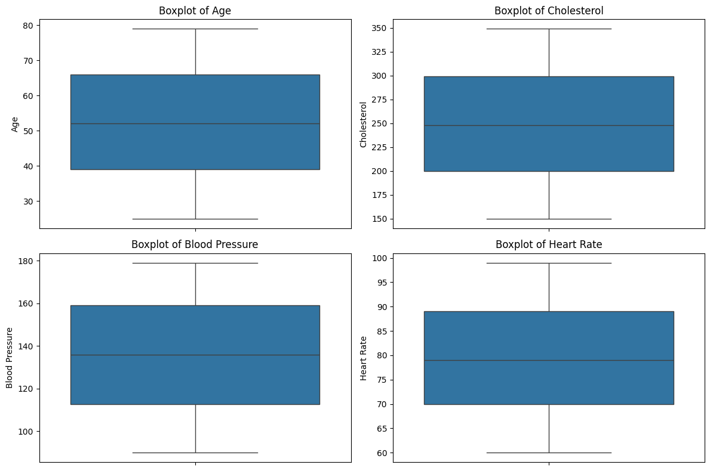
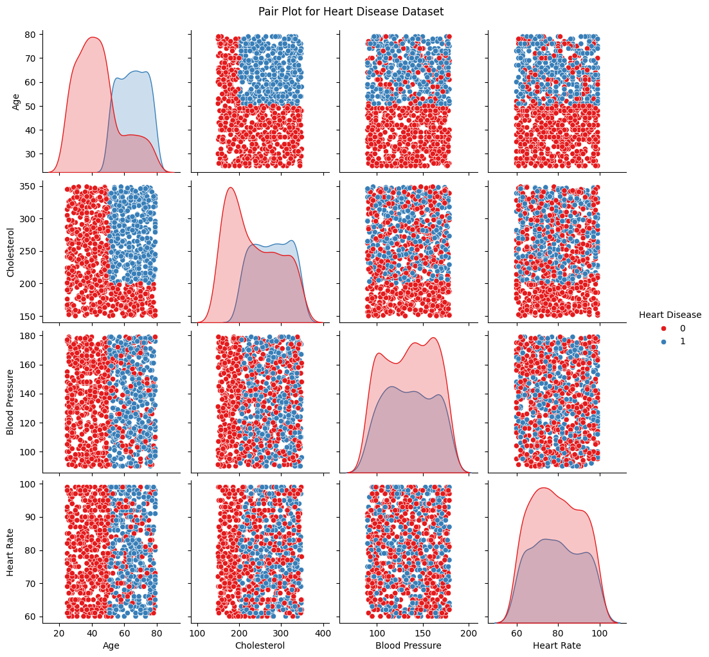

# Exploratory Data Analysis using Heart Disease Data Set

The Heart Disease dataset originally consisted of 1000 rows and 16 columns, as shown below:


### Data Set Description

- **Age**: Patient's age in years.
- **Gender**: Patient's gender (e.g., Male/Female).
- **Cholesterol**: Level of cholesterol in the blood (mg/dL).
- **Blood Pressure**: Patient’s blood pressure measurement (mmHg).
- **Heart Rate**: Resting heart rate (beats per minute).
- **Smoking**: Smoking status (e.g., Yes/No or pack-years).
- **Alcohol Intake**: Frequency or quantity of alcohol consumption.
- **Exercise Hours**: Number of hours exercised per week.
- **Family History**: Presence of heart disease in close relatives.
- **Diabetes**: Whether the patient has diabetes (Yes/No).
- **Obesity**: Obesity status based on BMI or body fat percentage.
- **Stress Level**: Measured or self-reported stress level.
- **Blood Sugar**: Blood glucose level (mg/dL).
- **Exercise Induced Angina**: Chest pain triggered by physical activity (Yes/No).
- **Chest Pain Type**: Type of chest pain (e.g., typical angina, atypical angina, non-anginal, asymptomatic).
- **Heart Disease**: Presence or absence of heart disease diagnosis (Yes/No).

## Data Cleaning

The following data cleaning steps were performed:

- **Column Removal:**  
  Removed irrelevant columns for the analysis: `Exercise Hours`, `Diabetes`, `Obesity`, `Stress Level`, `Blood Sugar`, `Exercise Induced Angina`, and `Chest Pain Type`.

- **Handling Missing Values:**  
  - Filled in missing values in the `Alcohol Intake` column with "No" assuming that person is a non drinker.

- **Duplicates:**  
  Checked for duplicates and there are no duplicates in the data set

- **Outlier Detection:**  
  No outliers detected.

  

## Univariate Analysis

### Age Distribution
```
Mean: 52.29
Median: 52
Standard Deviation: 15.73
Skewness: -0.03
```


The age distribution is approximately symmetrical (skewness = -0.03), indicating a balanced spread of ages around the mean of 52.29 years.

### Cholesterol Distribution
```
Mean: 249.94
Median: 248.0
Standard Deviation: 57.91
Skewness: 0.01
```


The cholesterol distribution is nearly symmetrical (skewness = 0.01), with a mean of 249.94 mg/dL, a median of 248 mg/dL, and a standard deviation of 57.91 mg/dL, indicating moderate variability in cholesterol levels.

### Blood Pressure Distribution
```
Mean: 135.28
Median: 136.0
Standard Deviation: 26.39
Skewness: -0.04
```


The blood pressure distribution is approximately symmetrical (skewness = -0.04), with a mean of 135.28 mmHg, a median of 136 mmHg, and a standard deviation of 26.39 mmHg, indicating moderate variability in blood pressure levels.

### Heart Rate Distribution
```
Mean: 79.2
Median: 79.0
Standard Deviation: 11.49
Skewness: 0.08
```


The heart rate distribution is nearly symmetrical (skewness = 0.08), with a mean of 79.2 bpm, a median of 79 bpm, and a standard deviation of 11.49 bpm, indicating relatively low variability in resting heart rates.

### Gender Analysis
```
Number of male patients:  497
Number of female patientss:  503
```


The dataset consists of 49.7% male patients (497) and 50.3% female patients (503), indicating a nearly balanced gender distribution.

### Smoking Analysis
```
Number of current smoking patients:  336
Number of former smoking patients:  326
Number of non smoking patients:  338
```


The dataset includes 33.6% current smokers (336), 32.6% former smokers (326), and 33.8% non-smokers (338), showing a nearly even distribution across smoking statuses.

### Alcohol Intake Analysis
```
Number of patients with heavy alcohol intake::  346
Number of patients with moderate alcohol intake::  314
Number of patients with no alcohol intake::  340
```


The dataset shows that 34.6% of patients have heavy alcohol intake (346), 31.4% have moderate alcohol intake (314), and 34.0% abstain from alcohol (340), indicating a fairly balanced distribution across intake levels.

### Family History Analysis
```
Number of patients with presence of heart disease in close relatives:  499
Number of patients with no presence of heart disease in close relatives:  501
```


The dataset indicates that 49.9% of patients have a family history of heart disease (499), while 50.1% do not (501), showing a nearly even distribution.

### Heart Disease Analysis
```
Number of patients with heart disease:  392
Number of patients with no heart disease:  608
```


The dataset shows that 39.2% of patients have heart disease (392), while 60.8% do not (608), indicating a higher proportion of individuals without heart disease.


## Bivariate Analysis

### Age vs Heart Disease


The correlation matrix shows a strong positive correlation (0.6469) between age and heart disease, indicating that as age increases, the likelihood of heart disease also tends to increase.


 No cases are observed in individuals under 40, while the 40-60 age group shows a moderate presence. In contrast, the majority of cases occur in those over 60, highlighting the strong correlation between aging and heart disease.The prevalence of heart disease increases significantly with age, making it a major risk factor. 
 
### Cholesterol vs Heart Disease


The correlation matrix shows a moderate positive correlation (0.3650) between cholesterol levels and heart disease, suggesting that higher cholesterol is associated with an increased likelihood of heart disease, though other factors may also contribute.


Higher cholesterol levels are associated with an increased prevalence of heart disease. In the low cholesterol category, only 42 patients have heart disease (vs. 296 without), while in the medium and high categories, heart disease cases rise to 172 (vs. 161) and 178 (vs. 151), respectively, highlighting cholesterol as a key risk factor.

### Blood Pressure vs Heart Disease


The correlation matrix shows a very weak positive correlation (0.0069) between blood pressure and heart disease, suggesting that blood pressure has little to no direct linear relationship with heart disease in this dataset.


Blood pressure levels do not show a strong association with heart disease, as cases remain relatively consistent across categories: 133 (vs. 209) in low, 131 (vs. 194) in medium, and 128 (vs. 205) in high blood pressure groups.

### Heart Rate vs Heart Disease


The correlation matrix shows a very weak positive correlation (0.0132) between heart rate and heart disease, indicating that heart rate has little to no direct linear relationship with heart disease in this dataset.


Heart rate shows no clear association with heart disease, as the number of cases remains relatively consistent across low (132 vs. 204), medium (124 vs. 209), and high (136 vs. 195) heart rate categories.

## Multivariate Analysis

### Pair Plot 


The pair plot visualizes relationships between age, cholesterol, blood pressure, and heart rate with heart disease. It highlights a strong association between age and heart disease, with older individuals more likely affected. Cholesterol shows some correlation, while blood pressure and heart rate appear to have weaker associations.

### Correlation Heat Map


The correlation heatmap shows weak correlations among age, cholesterol, blood pressure, and heart rate, with all values close to zero. This suggests that these variables are largely independent of each other in this dataset.

### Mean Values


The mean values for patients without heart disease (Heart Disease = 0) show an average age of 44.13, cholesterol level of 232.97, blood pressure of 135.13, and heart rate of 79.08. For patients with heart disease (Heart Disease = 1), the averages are higher, with an age of 64.96, cholesterol level of 276.26, blood pressure of 135.51, and heart rate of 79.39. This suggests that older age and higher cholesterol levels are more prevalent in those with heart disease
